# 고블린 키우기

작은 고블린을 키워서 직업을 고르고, 몬스터를 물리치며 왕이 되는 **방치형 RPG**입니다. 설치나 빌드 없이 `index.html`만 열면 바로 플레이할 수 있고, 휴대폰 화면에 맞춰 만들었습니다.

**[▶ 바로 플레이하기](https://hongsunsik.github.io/goblin-idle/)**

  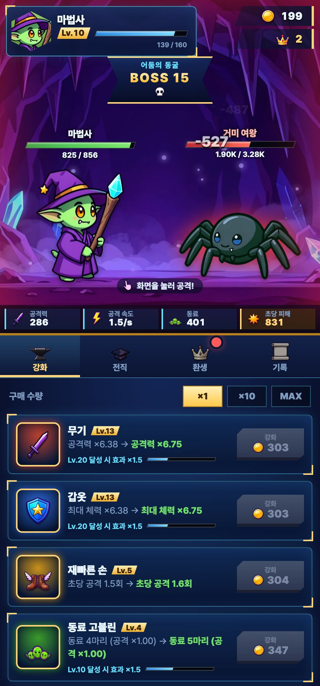
  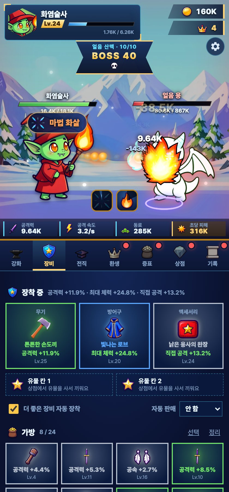
  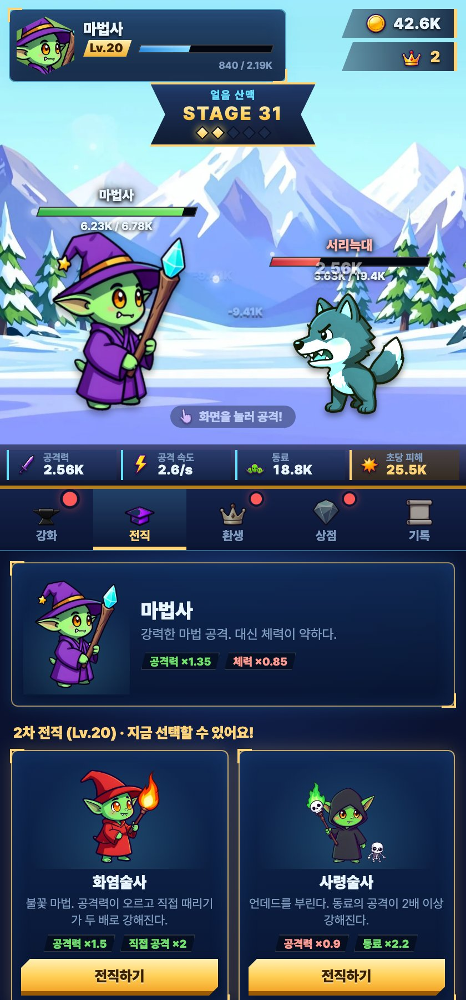
  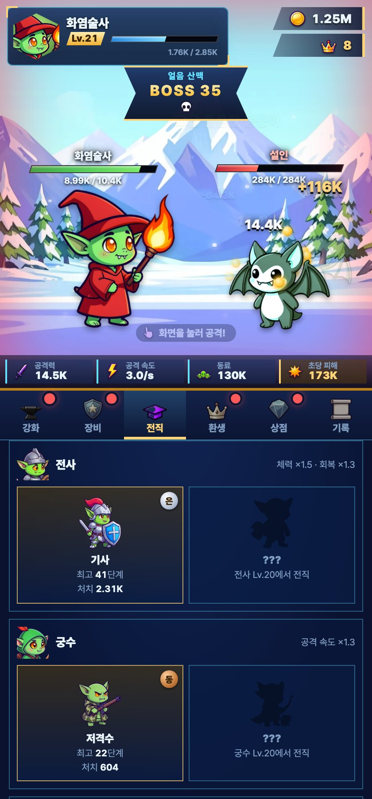

  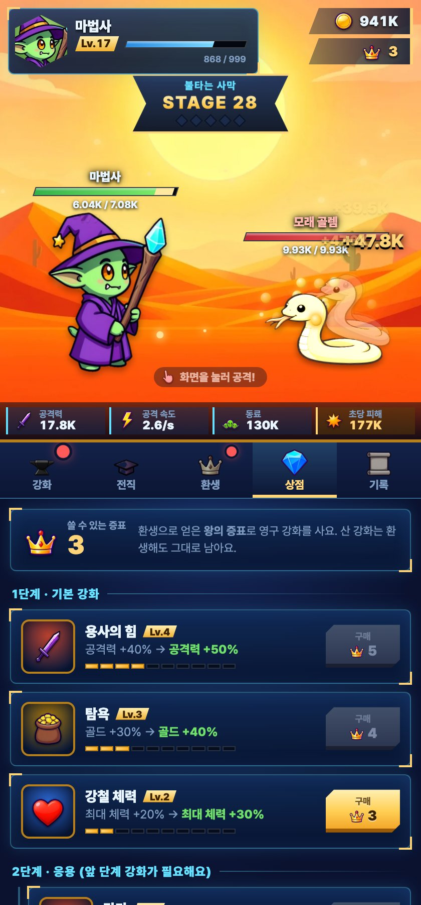
  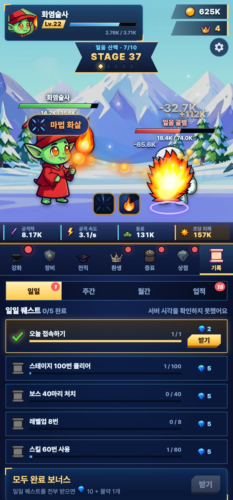
  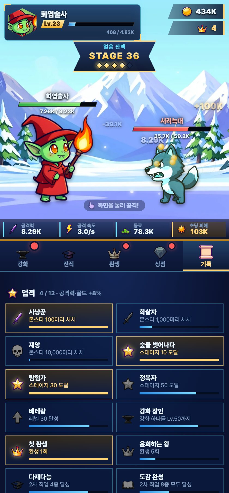
  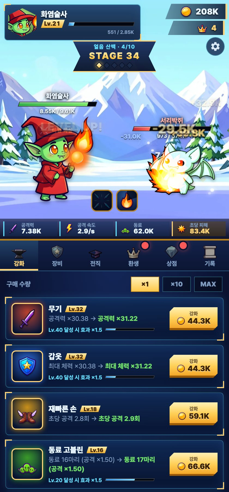
  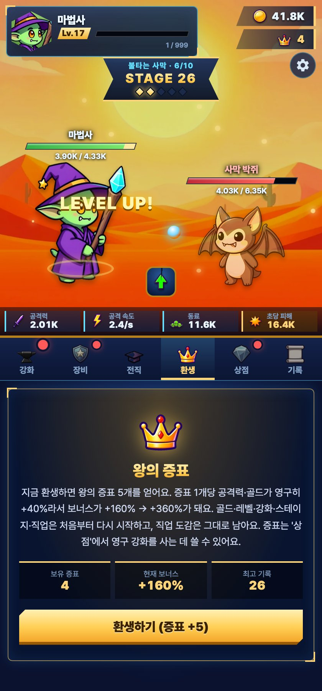

  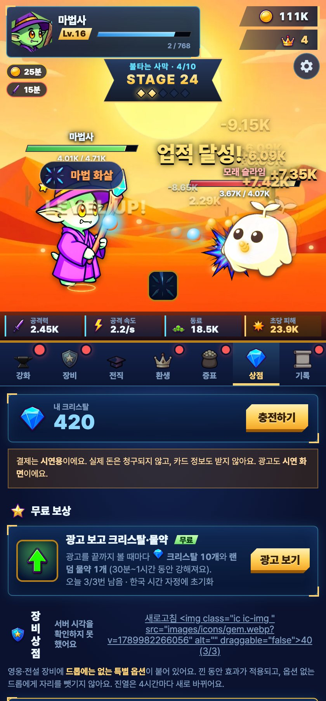
  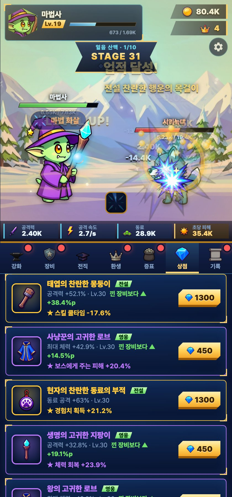
  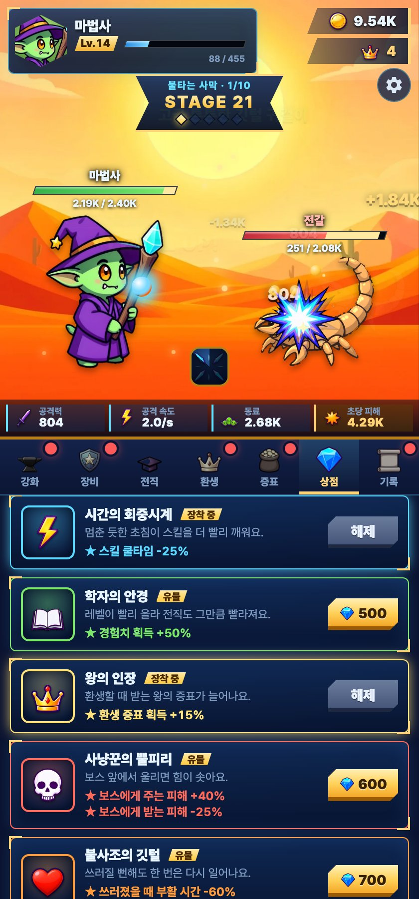

## 게임 방법

- 고블린이 **자동으로 싸웁니다.** 창을 켜 두기만 해도 골드와 경험치가 쌓입니다.
- **화면을 누르면** 공격력의 3배 피해를 줍니다. (컴퓨터에서는 스페이스바)
- 골드로 **강화**합니다: 무기(공격력), 갑옷(체력), 재빠른 손(공격 속도), 동료 고블린(자동 공격), 약탈 솜씨(골드).
  - 무기·갑옷·동료·약탈은 **레벨 10마다 효과가 1.5배**가 되는 마일스톤이 있어서, 강화를 이어 갈수록 성장이 계속됩니다.
- 5스테이지마다 **보스**가 나옵니다. 고블린이 쓰러지면 한 스테이지 뒤로 물러납니다.
- 10스테이지마다 **지역**이 바뀝니다: 고블린 숲 → 어둠의 동굴 → 불타는 사막 → 얼음 산맥 → 화산 지대 → 저주받은 성. 지역마다 배경과 몬스터, 떠다니는 빛의 색이 다릅니다.

### 장비

몬스터를 잡으면 **확률로 장비가 떨어집니다.** 일반 몬스터는 8%, 보스는 50%입니다.

- **3칸:** 무기(공격력), 방어구(최대 체력), 액세서리(골드 / 공격 속도 / 동료 공격 / 직접 공격 중 하나)
- **디자인 17종:** 이름마다 모양이 다릅니다. 무기 5종(몽둥이·단검·손도끼·장검·지팡이), 방어구 4종(가죽·쇠사슬·판금·로브), 액세서리 8종(반지·목걸이·팔찌·귀걸이·부적 등). 등급은 테두리 색과 빛으로 구분합니다.
- **등급:** 노말 · 고급 · 희귀 · 영웅 · 전설 · **유니크** · **신화**. 높을수록 확률이 낮습니다. 유니크는 전설의 약 1.5배, 신화는 유니크의 약 1.5배 수치이고, 테두리가 분홍·청록으로 강하게 빛납니다. 유니크 이상이 나오면 화면이 번쩍이고 고리가 여러 겹 퍼집니다.

| 등급 | 일반 몬스터 | 보스 |
|---|---|---|
| 노말 | 62% | 0% |
| 고급 | 25% | 44.6% |
| 희귀 | 9.5% | 34.7% |
| 영웅 | 3% | 15.9% |
| 전설 | 0.5% | 4% |
| 유니크 | 0.07% | 0.8% |
| 신화 | 0.008% | 0.1% |

- **수치:** 등급이 높을수록 크고 ±15% 무작위이며, **높은 스테이지에서 얻을수록 커집니다**(스테이지 40에서 나온 장비는 스테이지 1의 약 2배). 전설 무기는 스테이지 40에서 공격력 +52% 안팎입니다.
- **방치형에 맞춘 관리:** 더 좋은 장비를 얻으면 **자동 장착**하고, 정한 등급 이하는 얻자마자 **자동 판매**해 골드로 바꿉니다(둘 다 끄고 켤 수 있음). **자동 판매는 노말부터 전설까지 고를 수 있고**(영웅·전설을 고르면 한 번 더 확인), **특별 옵션(★) 장비와 유니크·신화는 어떤 설정에서도 팔리지 않습니다.** 가방은 24칸이고 가득 차면 새 장비는 자동으로 팔립니다. **정리**로 등급별(노말~전설 이하)·약한 장비를 한꺼번에 팝니다(영웅·전설이 들어가면 한 번 더 확인).
- 장비를 누르면 지금 낀 장비와 수치를 **비교**해 보여 주고, 영웅 이상을 팔 때는 한 번 더 확인합니다.
- **판매를 편하게:** 가방의 **선택** 버튼으로 여러 장비를 눌러 골라 한 번에 팔 수 있고(고른 개수와 받을 골드가 실시간으로 보임), **정리** 버튼으로 "노말 이하 / 고급 이하 / 희귀 이하 / 지금 낀 장비보다 약한 것"을 개수와 골드를 미리 보고 한꺼번에 팔 수 있습니다. "약한 것"은 같은 칸·같은 능력의 장비끼리만 비교합니다.
- **분해와 장비 레벨:** 장비를 **분해**하면 **가루**가 나오고(등급·레벨·강화 단계가 높을수록 많음), 가루로 **장비 레벨을 올립니다**(+1 / +10 / 최대). 레벨이 오르면 수치도 같은 비율로 오르고, 처음 뽑힌 좋은 편차는 그대로 남습니다. 상한은 **내 최고 스테이지**라서 예전에 얻은 좋은 장비를 지금 진행도까지 끌어올려 계속 쓸 수 있습니다. '판매 대신 분해'를 켜면 자동 판매 대상이 골드 대신 가루가 됩니다. (봇 실측: 후반엔 10분 판마다 가루 약 600~800, 옛 신화 장비 30→140레벨은 약 2,600)
- 장비는 환생해도 남고, 증표 상점의 '수집가'로 드롭 확률을 올릴 수 있습니다. 창을 닫아 둔 사이에 얻은 장비도 돌아왔을 때 알려 줍니다.

### 스킬

**직업 60개(1~4차)마다 스킬이 하나씩** 있고, 전직할 때마다 그 직업의 스킬이 쌓입니다(4차까지 가면 최대 4개). 쿨타임이 차고 **상황이 맞으면 자동으로** 씁니다. 스킬마다 **고유한 아이콘**이 있고, 쓸 때는 화면 위에 아이콘과 이름이 붙은 **스킬 배너**가 튀어나오며 종류에 맞는 이펙트가 나옵니다. 화면 아래 스킬 바에서 남은 쿨타임(부채꼴)과 발동 중인 효과를 볼 수 있고, 아이콘을 누르면 설명이 나옵니다. 전직 선택지 카드와 확인 창에서 **새로 얻을 스킬을 미리** 볼 수 있습니다.

**효과 16종** (위력은 1차 기준, 2차 ×1.25 · 3차 ×1.5 · 4차 ×1.8)

| 분류 | 종류 | 효과 | 쓰는 상황 | 쿨타임 |
|---|---|---|---|---|
| 즉시 피해 | 강타 | 공격력 ×3.0 | 언제나 | 14초 |
| | 연타 | 공격력 ×1.0을 4번 | 언제나 | 12초 |
| | 처형 | 공격력 ×7.0 | 몬스터 체력 40% 아래일 때 | 13초 |
| | 보스 사냥 | 공격력 ×9.0 | 보스가 나왔을 때 | 15초 |
| | 소환 | 내 초당 피해의 30%를 6초분 | 언제나 | 16초 |
| | 지속 피해 | 매초 내 초당 피해의 40%를 8초 (불·독·공허·태양) | 몬스터 체력 절반 넘을 때, 이미 걸려 있지 않을 때 | 18초 |
| 공격 강화 | 가속 | 공격 속도 +35% (6초) | 언제나 | 18초 |
| | 강화 | 공격력 +30% (6초) | 언제나 | 18초 |
| | 광란 | 공격 속도·공격력 +25% (8초) | 언제나 | 30초 |
| | 흡혈 | 준 피해의 25%를 회복 (8초) | 체력 90% 아래일 때 | 22초 |
| 방어·회복 | 회복 | 최대 체력의 20% 회복 | 체력 70% 아래일 때 | 25초 |
| | 방어 | 받는 피해 -30% (6초) | 체력 85% 아래일 때 | 20초 |
| | 방벽 | 최대 체력 35%만큼 피해를 대신 막음 (8초) | 체력 75% 아래일 때 | 24초 |
| | 기절 | 몬스터가 3초 동안 공격하지 못함 | 체력 85% 아래일 때 | 22초 |
| 재화 | 약탈 | 골드 +50% (8초) | 언제나 | 24초 |
| | 전리품 | 처치 골드의 6배를 즉시 얻음 | 언제나 | 26초 |

예를 들어 마법사 → 화염술사 → 업화술사 → 화염 황제 경로는 마법 화살(연타) · 점화(지속 피해) · 지옥불 폭격(강타) · 화염 제국(강타)을 가지고, 궁수 → 저격수 → 명사수 → 신의 눈 경로는 속사(가속) · 급소 저격(처형) · 거인 저격(보스 사냥) · 천안 사격(연타)을 가집니다. 스킬은 쓰러져 있을 때는 멈추고, 환생하면 쿨타임과 효과가 초기화됩니다. 기절한 몬스터 위에는 별이, 방벽이 있는 동안 고블린 둘레에는 방울이, 지속 피해가 걸린 몬스터는 불타는(또는 독·공허) 색으로 표시됩니다.

### 전직

레벨이 오르면 4번까지 전직합니다. **단계마다 2갈래로 갈라지고**, 고른 길에 따라 능력치 배율이 곱해집니다.

| 단계 | 조건 | 선택지 |
|---|---|---|
| 1차 | Lv.10 | 전사 / 궁수 / 마법사 / 도적 (4종) |
| 2차 | Lv.20 | 1차마다 2갈래 (8종) |
| 3차 | Lv.30 | 2차마다 2갈래 (16종) |
| 4차 | Lv.40 | 3차마다 2갈래 (32종) |

예를 들어 마법사 → 화염술사(직접 공격) → 불사조술사(체력·회복) → 불사조의 주인(체력 ×1.5, 회복 ×1.8)처럼 이어집니다. 마법사 계열만 해도 4차 직업이 8종이고, 전체로는 **도감에 56종**(2차 8 + 3차 16 + 4차 32)이 있습니다. 직업마다 설명과 능력치 배율이 다르고, 고블린의 모습도 직업에 맞게 바뀝니다. 환생하면 직업이 초기화되어 다른 길을 골라 볼 수 있습니다.

#### 직업 도감

전직을 달성한 직업은 **도감**에 기록되고, 하나당 공격력·골드가 영구히 오릅니다. 도감은 **2차 / 3차 / 4차 탭**으로 나뉘고, 부모 직업별로 묶여 자식 2갈래를 보여 줍니다. 카드를 누르면 자세한 정보가 나옵니다.

- **기록:** 그 직업으로 도달한 **최고 스테이지**, **처치 수**, **전직 횟수**. 4차까지 간 판에서는 거쳐 온 2·3·4차 직업 모두에 기록됩니다.
- **직업 보너스:** 2차 +5%, 3차 +1.5%, 4차 +0.5% (차수가 높을수록 하나당 작습니다).
- **등급:** 최고 스테이지가 기준을 넘을 때마다 동·은·금 메달을 받고, 메달 하나마다 그 직업 보너스가 기본값의 20%씩 늘어납니다. 기준은 2차 20/35/50, 3차 30/45/60, 4차 40/55/70입니다.
- 아직 만나지 못한 직업은 실루엣과 "어떤 순서로 전직하면 만나는지" 힌트만 보입니다.

### 환생

스테이지 10 이상에서 환생하면 골드·레벨·강화·스테이지·**직업**이 처음으로 돌아가지만, **왕의 증표**를 얻어 공격력·골드가 영구히 강해집니다(증표 1개당 +32%, 체력도 조금). 직업이 초기화되므로 다른 직업을 골라 다시 키워 볼 수 있고, 도감은 그대로 남습니다.

- **증표 개수:** 이번 판에서 도달한 스테이지 5개당 1개에, **이번 판을 키운 시간**을 곱합니다. 판을 **10분 이상** 키우면 100%이고, 그보다 짧으면 시간에 비례합니다(스테이지가 오르면 앞 스테이지가 몇 초 만에 지나가서, 짧게 환생을 반복하는 쪽이 오래 키우는 것보다 증표를 3.5배 더 벌었기 때문입니다. 환생 화면에서 지금 몇 %인지, 몇 분 더 키우면 몇 개인지 보입니다).
- **전직과 증표의 관계 (직업 공명):** 전직을 한 단계 할 때마다 증표의 힘이 8%씩 더 깨어나서, 증표 1개당 효과가 **+32%(견습) → +42%(4차 직업)** 로 커집니다. 환생하면 직업이 초기화되므로 판마다 다시 전직해서 증표의 힘을 깨우는 셈입니다. 증표 상점 4단계의 **직업 각성**(직업 능력의 장점 배율을 강화)과 **도감 공명**(직업 도감 보너스 +20%씩)도 전직과 이어진 강화입니다.
- **증표는 체력에도 깃듭니다.** 예전에는 증표가 공격력·골드만 올려서, 증표를 많이 모으면 몬스터는 한 번에 죽는데 고블린이 1초 만에 쓰러져 스테이지 90 근처에서 멈췄습니다(증표를 2배로 늘려도 거의 안 올랐습니다). 지금은 증표 효과의 0.4제곱만큼 최대 체력도 늘어납니다.

### 증표 상점

(**증표** 탭) 환생으로 얻은 **왕의 증표**를 써서 **영구 강화**를 삽니다. 산 강화는 환생해도 남습니다. 증표를 써도 공격력·골드 보너스(지금까지 번 증표 기준)는 줄지 않습니다.

| 단계 | 강화 | 효과 (레벨마다) | 열리는 조건 |
|---|---|---|---|
| 1 | 용사의 힘 / 탐욕 / 강철 체력 | 공격력 / 골드 / 체력 +10% (최대 Lv.10) | 없음 |
| 2 | 강타 | 직접 공격 +25% (최대 Lv.5) | 용사의 힘 Lv.3 |
| 2 | 동료의 유대 | 동료 공격 +10% (최대 Lv.10) | 강철 체력 Lv.3 |
| 2 | 든든한 휴식 | 오프라인 보상 한도 +1시간 (최대 Lv.4) | 탐욕 Lv.3 |
| 2 | 수집가 | 장비 드롭 확률 +1.5%p (최대 Lv.10) | 탐욕 Lv.2 |
| 3 | 빠른 출발 | 환생 후 무기·갑옷을 Lv.+3 상태로 시작 (최대 Lv.5) | 용사의 힘 Lv.5 |
| 3 | 왕의 위엄 | 공격력·골드 +5% (최대 Lv.5) | 용사의 힘 Lv.5 + 탐욕 Lv.5 |
| 4 | 직업 각성 | 직업 능력의 장점(1보다 큰 배율)이 10%씩 더 강해짐, 단점은 그대로 (최대 Lv.5) | 왕의 위엄 Lv.1 |
| 4 | 도감 공명 | 직업 도감 보너스 +20% (최대 Lv.5) | 왕의 위엄 Lv.1 |

가격은 레벨이 오를수록 비싸지고(다음 레벨 = 기본 가격 × (현재 레벨 + 1)개), 구매하기 전에 무엇을 얼마에 사는지 **확인 창**이 뜹니다. **강화 초기화**를 누르면 쓴 증표를 전부 돌려받아 다른 강화에 다시 쓸 수 있습니다. 전부 채우려면 증표가 675개 필요합니다.

### 상점 (크리스탈)

**증표 탭**이 왕의 증표로 사는 영구 강화이고, 별도의 **상점 탭**에서는 **크리스탈**로 특별 옵션 장비·장비 상자·유물·편의 상품을 삽니다. **물약은 팔지 않고 광고를 볼 때 받습니다.**

- **신화 보장:** 장비 상자·칸별 뽑기에 크리스탈을 2,700개 쓰면(전설 상자 3개째) 그 구매의 첫 장비가 **신화 확정**입니다. 상점에 게이지가 보이고, 운 좋게 신화가 먼저 나오면 처음부터 다시 쌓입니다.
- **장비 상점**에는 칸마다 유니크 6%·신화 2% 확률로 특별 옵션 장비가 진열됩니다(유니크 2,400 · 신화 4,500 크리스탈).

> **결제와 광고는 시연 모드입니다.** 충전 버튼은 결제 확인 창만 보여 줄 뿐 **실제 돈이 청구되지 않고**, 광고도 실제 광고가 아니라 5초 카운트다운 화면입니다. 실제 결제·광고는 결제대행사 계약, 서버(결제 확인·서버 쪽 지갑), 광고 네트워크 승인이 있어야 하며, 필요한 것과 설계는 [docs/PAYMENTS.md](docs/PAYMENTS.md)에 정리했습니다. (`payments-config.js`에서 `off`로 바꾸면 충전·광고 버튼이 잠깁니다.)

| 상품 | 가격 | 효과 |
|---|---|---|
| 장비 상점의 영웅 장비 | 450 | 특별 옵션이 하나 붙은 영웅 장비 (아래 참고) |
| 장비 상점의 전설 장비 | 1300 | 특별 옵션이 하나 붙은 전설 장비 (아래 참고) |
| 고급 장비 상자 | 100 | 장비 3개 · 고급 60% / 희귀 30% / 영웅 9% / 전설 1% |
| 영웅 장비 상자 | 300 | 장비 1개 · 영웅 85% / 전설 15% |
| 전설 장비 상자 | 900 | 전설 이상 장비 1개 · 전설 90% / 유니크 9% / 신화 1% |
| 가방 확장 | 80 | 가방 +6칸 (최대 +18칸) |
| 시작 패키지 | 250 | 영웅 장비 + 황금·힘의 물약 (계정당 1번) |

- **장비 상점 (시간마다 갱신):** 특별 옵션이 하나 붙은 **영웅·전설 장비 6개**(무기·방어구·액세서리 2개씩, 전설은 약 25%)가 진열되고, **4시간마다 새 물건으로 바뀝니다**. 남은 시간이 화면에 보이고, 크리스탈 40개로 **새로고침**할 수도 있습니다(한 갱신 시간에 3번까지). 진열은 (시간 구간, 새로고침 횟수, 내 최고 스테이지)만으로 계산하므로 언제 열어도 같고, 구간은 광고 횟수와 같은 방식으로 **서버 시각**으로 셉니다(기기 시계를 돌려도, 서버 시각을 못 받아도 새 물건이 나오지 않음).
  - 특별 옵션 8종: 경험치 획득 / 보스에게 주는 피해 / 스킬 쿨타임 감소 / 받는 피해 감소 / 체력 회복 / 장비 드롭 확률 / 환생 증표 / 부활 시간 감소. 영웅은 예를 들어 경험치 +10~16%, 전설은 +18~28%처럼 등급마다 범위가 정해져 있고, 한 진열 안에서 옵션이 겹치지 않습니다.
  - 장비 이름 앞에 옵션 이름이 붙습니다(예: **사냥꾼의** 고귀한 장검). 수치는 드롭(±15%)과 달리 기본값 이상으로 나오고, **옵션 없는 드롭에게 자리를 뺏기지 않으며** 옵션 있는 쪽은 수치가 90%만 돼도 자리를 얻습니다. 가방 "정리"·자동 판매 대상도 아닙니다. 장비 탭과 장비 창에 ★로 옵션이 보이고, 낀 장비의 옵션은 유물과 합쳐집니다(쿨타임 감소 60%·받는 피해 감소 70% 같은 상한이 있습니다).
- **유물 (특별 옵션):** 드롭 장비에는 없는 옵션이 붙은 크리스탈 전용 상품입니다. 한 번 사면 영구히 내 것이고 환생해도 남으며, **2개까지만 장착**할 수 있어서 상황에 맞게 바꿔 끼웁니다 (장비 탭에 장착한 유물이 보입니다).

| 유물 | 가격 | 특별 옵션 |
|---|---|---|
| 학자의 안경 | 500 | 경험치 획득 +50% |
| 불사조의 깃털 | 700 | 부활 시간 -60% · 쓰러질 순간 45초에 한 번 체력 40%로 버팀 |
| 수호자의 방패 | 700 | 받는 피해 -20% · 체력 회복 +50% |
| 사냥꾼의 뿔피리 | 600 | 보스에게 주는 피해 +40% · 보스에게 받는 피해 -25% |
| 동료의 나팔 | 600 | 동료 공격 +50% |
| 시간의 회중시계 | 700 | 스킬 쿨타임 -25% |
| 탐욕의 금고 | 900 | 골드 +30% · 오프라인 보상 한도 +2시간 |
| 네잎클로버 | 800 | 장비 드롭 확률 +5%p · 희귀 이상 등급 확률 ×1.5 |
| 왕의 인장 | 1200 | 환생 증표 +15% |

- 유물의 효과는 시뮬레이션으로 재 봤습니다 (15분 판 기준). 첫 판에는 스테이지가 +2~4 올라가는 것이 많지만(시간의 회중시계는 스킬을 거의 안 쓰는 봇이라 +0.3), 증표가 쌓인 뒤에는 벽이 체력이라 +0~1 정도만 올라갑니다. 그래서 스테이지를 미는 힘이 아니라 **빌드에 맞는 편의**로 고르게 만들었습니다. (한 번 만들었던 "쓰러져도 스테이지가 뒤로 가지 않음"은 오히려 쓰러진 자리에서 못 벗어나 -7~-9 스테이지가 나와서 버렸습니다.)
- **물약:** 광고 1번에 **랜덤 물약 1개**를 받습니다 (황금·힘·신속·지혜·행운 30분, 용사의 비약 1시간은 드물게). 다시 받으면 시간이 늘어나고(최대 3시간), 게임을 꺼 둔 동안에도 줄어듭니다. 화면에 남은 시간이 표시됩니다.
- 장비 상자의 **등급 확률은 상품 카드와 구매 확인 창에 그대로 공개**됩니다. 장비 레벨은 지금까지 도달한 최고 스테이지 기준입니다. 산 장비는 자동 판매되지 않습니다.
- **업적 보상:** 업적을 달성하면 기록 탭에서 크리스탈을 받습니다 (위 업적 참고).
- **광고 보고 크리스탈·물약:** 광고를 끝까지 볼 때마다 **크리스탈 10개와 물약 1개**, **하루 3번**(하루 최대 크리스탈 30개, 한국 시간 자정에 초기화). 중간에 그만두면 횟수가 줄지 않습니다. **기기 시계를 바꿔도 횟수를 늘릴 수 없습니다.** 오늘 날짜를 기기 시계가 아니라 사이트를 내려 주는 서버의 응답 시각(HTTP `Date` 헤더)으로 정하고, 서버 시각을 못 받는 상태(오프라인·로컬 파일로 열기)에서는 새 하루로 넘어가지 않습니다. 새 하루는 인터넷에 연결돼 있어야 시작됩니다.
- 충전 상품(시연): 60개 1,200원 · 330개 5,900원 · 700개 11,000원 · 1,500개 22,000원 · 4,000개 55,000원 (보너스 포함 개수).
- **알아 둘 한계:** 이 게임은 브라우저에서 계산하므로 저장 데이터를 직접 고쳐 크리스탈이나 광고 횟수를 늘리는 것은 막을 수 없습니다. (시계 조작만 막았습니다.) 실제 결제를 붙일 때는 서버 쪽 지갑으로 바꿔야 합니다 ([PAYMENTS.md](docs/PAYMENTS.md)).

### 스테이지와 지역

지역은 10스테이지씩이고, 6개 지역(숲 → 동굴 → 사막 → 얼음 → 화산 → 성)을 돌면 **회차**가 올라갑니다.

- **몬스터 배치가 정해져 있습니다.** 한 지역 안에서 일반 몬스터 5종이 모두 나오고, 5·10번째 스테이지는 그 지역 보스 2종이 차례로 맡습니다. 앞쪽(1~4)에서 4종을 차례로 만나고 첫 보스 뒤에 5번째 몬스터가 등장합니다. 같은 몬스터가 두 스테이지 연속으로 나오지 않습니다. (예전에는 5번째 몬스터가 보스 자리와 겹쳐 한 번도 나오지 않는 결함이 있었습니다. 지역 안 전체 배치를 테스트로 검사합니다.)
- **지역 안 진행이 보입니다.** 지역 이름 옆에 `고블린 숲 · 3/10`처럼 표시되고, 배경이 초반(1~4)은 밝게, 후반(6~9)은 어둡게, 보스 스테이지는 더 어둡고 진하게 바뀝니다.
- **회차:** 스테이지 61부터는 `고블린 숲 II`처럼 이름에 회차가 붙고, 하늘과 몬스터의 색조가 회차마다 달라져서 같은 지역이 그대로 반복되는 느낌을 줄였습니다. (새 그림 없이 색조로만 구분한 것이라, 몬스터·배경 종류를 실제로 늘리는 것은 그림을 새로 만들어야 합니다.)

### 서버 출석과 친선 랭킹 (기록 탭, Google 연동 필요)

- **서버 출석:** 기록 탭 > 일일 위쪽 카드에서 **하루에 한 번** 출석 체크를 하면 7일 주기(3·3·5·5·8·8·20 크리스탈)로 보상을 받습니다. 날짜는 **서버 시각(한국 시간 자정)** 을 서버 규칙이 계산하므로 기기 시계를 바꿔도 연속 출석을 늘릴 수 없고, 하루 이상 건너뛰면 1일부터 다시 시작합니다.
- **친선 랭킹:** 기록 탭 > 랭킹에서 닉네임을 정하고 참여합니다(최고 스테이지 / 누적 증표 / 업적 수, 상위 50). 기록은 각자 알리는 값이라 조작할 수 있어서 **보상은 없습니다.** 내 기록 지우기·닉네임 바꾸기가 있고, 쓰기 횟수를 아끼려고 바뀐 것만 5분에 한 번 올리고 목록은 1분 동안 다시 부르지 않습니다.
- **서버 규칙을 게시해야 켜집니다**(Cloud Functions·Blaze 요금제 없이 Firestore 규칙만 씁니다). 방법과 한계는 [FIREBASE-SETUP.md](docs/FIREBASE-SETUP.md), 검토는 [STORE-BACKEND.md](docs/STORE-BACKEND.md)에 있습니다.

### 퀘스트와 업적 (기록 탭)

기록 탭 위쪽의 **일일 / 주간 / 월간 / 업적** 단추로 나뉩니다. 받을 보상이 있으면 단추에 개수가 뜨고, 아래 메뉴의 기록 탭에도 알림 점이 뜹니다.

**일일·주간·월간 퀘스트**

| 종류 | 개수 | 보상 (하나당) | 모두 받으면 | 바뀌는 때 (한국 시간) |
|---|---|---|---|---|
| 일일 | 5 (첫째는 "오늘 접속하기") | 크리스탈 5 (접속하기 2) | 크리스탈 10 + 물약 1 | 매일 자정 |
| 주간 | 5 | 크리스탈 20 | 크리스탈 40 | 월요일 0시 |
| 월간 | 4 | 크리스탈 60 | 크리스탈 120 | 매월 1일 0시 |

- 목표는 몬스터·보스 처치, 스테이지 클리어, 스킬 사용, 직접 공격, 장비 얻기·팔기, 영웅 이상 장비, 레벨업, 광고, 환생, 장비 상점 구매 중에서 기간마다 뽑힙니다. 같은 기간에는 항상 같은 목표이고, 목표 크기는 최고 스테이지에 따라 3단계(30 미만 / 80 미만 / 80 이상)로 커집니다.
- 진행도는 **기간이 시작될 때 적어 둔 기록과의 차이**라서 이벤트마다 따로 세지 않습니다. 기간이 끝날 때까지 받지 않은 보상은 사라집니다. 환생해도 진행은 남습니다.
- 기간은 광고 횟수와 같은 **서버 시각**으로 셉니다(기기 시계를 바꿔도 새 퀘스트가 나오지 않고, 초기화까지 남은 시간이 보입니다). 무료로 얻는 크리스탈은 퀘스트를 전부 하면 하루 평균 약 60개(일일 35 + 주간 100/7 + 월간 240/30 + 보너스)이고, 광고 30개와 합쳐 하루 90개 안팎입니다.

**업적 (159개)**

**159가지 업적**이 10개 분류(처치·스테이지·성장·환생·직업·장비·수집·재화·활동·기타)로 있습니다. 같은 종류를 단계별로 늘렸습니다: 강화 레벨(무기·갑옷·약탈·동료·속도), 스테이지 최대 200, 환생 100회, 등급별 장비 획득(영웅·전설·유니크·신화), 유니크·신화 3칸 장착, 도감 금메달, 장비 상점·상자·유물 수집, 누적 골드(최대 1자), 크리스탈 지출, 광고, 스킬·직접 공격 횟수, 총 모험 시간(자리를 비운 시간 포함), 접속일 수(최대 365일), 퀘스트 완료·전부 완료한 날 수(일·주·월) 등입니다. 기록은 환생해도 유지됩니다.

- 달성할 때마다 공격력·골드가 영구히 **+0.5%**(전부 달성하면 +80%)입니다.
- **크리스탈 보상:** 3~100개(전부 달성하면 약 5,150개). **기록 탭 > 업적에서 받습니다**("받기" 또는 "모두 받기"). 예전 저장에서 이미 달성한 업적도 보상을 받을 수 있습니다.
- 분류는 접었다 펼 수 있고(받을 보상이 있는 분류는 처음부터 펼쳐짐), 카드마다 진행도(예: 154 / 1.00K)와 보상이 보입니다. 같은 종류는 목표가 커질수록 보상도 같거나 커집니다(테스트로 확인).

### 던전과 무한의 탑 (던전 탭)

- **일일·주간·월간 던전**: 기간마다 정해진 횟수만큼 도전합니다(일일 3번·주간 1번·월간 1번). 도전하면 먼저 미니게임(두더지 잡기·타이밍 게이지·패턴 반격)으로 피해 예산을 최대 +35~50% 늘리고, 그 예산으로 파동마다 다른 보스를 차례로 물리칩니다. 보스 체력이 깎이는 전투 연출 뒤에 보상이 나옵니다.
- 카드와 도전 창에 **지금 전투력으로 몇 파동까지 가능한지, 미니게임을 잘하면 몇 파동인지** 미리 보여 줍니다.
- 한 번 완주한 던전은 **소탕**(미니게임 없이 이번 기간 최고 보너스로 바로 도전)할 수 있고, 못 잡은 보스도 깎은 만큼 위로 골드를 줍니다.
- **무한의 탑**: 횟수 제한 없이 전투력만큼 한 번에 최대 10층씩 오릅니다. 층의 세기는 고정값이라 최고 층이 곧 내 전투력 기록입니다. 새 층마다 크리스탈, 5층마다 장비, 10층마다 증표, 하루 한 번 최고 층에 비례한 크리스탈을 줍니다.

### 로그인·클라우드 저장

**Google 계정을 연동**하면 진행 상황이 클라우드(Firebase)에 저장돼서 기기를 바꿔도 이어서 할 수 있습니다. 화면 오른쪽 위 **⚙ 설정 → 계정 연동**에서 연동합니다. 계정을 여러 개 쓰는 사람을 위해 **연동할 때마다 계정 선택 화면**이 뜨고, **한 번 연동하면 해제할 수 없습니다**(연동 전에 화면에 경고가 보입니다).

- 새 기기에서 로그인하면 클라우드 저장을 바로 이어받습니다.
- 이 기기와 클라우드가 **모두 진행됐으면 어느 쪽으로 계속할지 묻고**, 진행이 더 앞선 쪽을 추천합니다.
- 다른 기기가 먼저 저장했다면 **덮어쓰지 않고 물어봅니다.** 저장마다 번호를 붙여 앱과 서버 규칙 양쪽에서 확인합니다.
- **저장은 전부 자동입니다.** 저장 버튼은 없고, 환생·전직·상점 구매 뒤 바로, 평소에는 1분마다, 창을 가릴 때 저장합니다. 한동안 다른 화면에 있다 돌아오면 다른 기기에서 진행했는지 확인해 이어받고, 저장이 실패하면 자동으로 다시 시도합니다. **바뀐 게 없으면 서버에 쓰지 않습니다.**
- Firebase 설정(`firebase-config.js`)이 없으면 이 기능은 꺼지고 게임은 이 기기에만 저장합니다. 다른 Firebase 프로젝트로 바꾸려면 [설정 방법](docs/FIREBASE-SETUP.md)을 보세요.

### 그 밖에

- **오프라인 보상 (자리를 비운 시간):** 창을 닫거나, 다른 탭·앱으로 옮기거나, 기기가 잠들어도 **최대 8시간**(든든한 휴식·탐욕의 금고로 늘어남) 동안 고블린이 싸운 결과를 돌아왔을 때 받습니다. 세 경우 모두 같은 규칙으로 잽니다.
  - **서버 시각 기준:** 저장할 때 서버 시각(사이트가 내려 주는 응답 시각)을 함께 적어 두고, 다음에 열 때의 서버 시각과의 차이를 비운 시간으로 씁니다. 기기 시계를 앞으로 돌려 8시간을 받거나, 시계가 틀어져서 손해를 보는 일이 없습니다. 서버 시각을 못 받으면(오프라인·로컬 파일·옛 저장) 기기 시계 차이로 잽니다. 보상 창에 "서버 시각 기준"인지 "기기 시계 기준"인지, 시계가 크게 어긋나 서버 시각으로 계산했는지(2분 넘게 차이) 알려 줍니다.
  - **백그라운드 탭:** 브라우저는 안 보이는 탭의 타이머를 늦추거나 멈춥니다. 깨어날 때마다 서버 시각을 다시 받아서 그 사이 시간을 보상으로 계산하고, 화면 밖에 있는 동안 여러 번 깨어난 시간은 **합쳐서 한도를 지키며 돌아왔을 때 한 번만** 알려 줍니다(예전에는 깨어날 때마다 보상 창이 떴습니다).
  - **시작할 때:** 서버 시각을 먼저 확인(최대 2.5초)한 뒤 계산하고, 그 전에는 저장하지 않아서 비운 시간이 사라지지 않습니다.
  - **클라우드:** 다른 기기의 저장을 받아오면 그 저장 이후 지금까지 비운 시간도 인정합니다(예전에는 사라졌습니다). 다른 기기에서 이미 받았다면 그 기기가 저장 시각을 옮겨 두었으므로 두 번 받지 않습니다.
  - **한 번만:** 받고 나면 저장 시각이 지금으로 옮겨지고, 30초 미만이라 보상이 없어도 옮겨져서 짧게 여러 번 열어도 시간이 새지 않습니다. 기록 탭 아래에 한도와 기준이 항상 보입니다.
- 진행 상황은 브라우저에 **자동 저장**됩니다.

## 그림과 화면

고블린·몬스터·아이콘·배경은 `images/` 폴더의 **AI 생성 이미지**(`tools/generate-images.py`로 생성, 프롬프트는 [images/README.md](images/README.md))를 씁니다. 화면 구성과 애니메이션, 게임 로직은 모두 직접 짰습니다. 이미지가 없는 항목은 **직접 SVG 코드로 그린 그림**(3·4차 직업은 윗단계 직업 그림, 스킬 아이콘은 기본 아이콘, 이펙트는 CSS)으로 자동 대체되는 구조라서, 그림을 한 장씩 바꿔 가도 게임이 깨지지 않습니다.

- **고블린 61종** (견습 1 + 1차 4 + 2차 8 + 3차 16 + 4차 32): 직업마다 모자·옷·무기·소품이 다릅니다. 3·4차는 윗단계 그림에 장식을 더한 모습이 아니라 각각 새로 그렸습니다(세라핌 기사는 날개와 후광, 늑대왕은 늑대 두 마리와 함께).
- **몬스터 13종**: 슬라임, 박쥐, 늑대, 멧돼지, 거미, 뱀, 해골, 유령, 전갈, 골렘, 악마, 오거, 용. 그림은 종류마다 한 장이지만, **지역마다 CSS 색 필터를 씌워서** 얼음 지역에서는 청록빛, 사막에서는 모래빛으로 다르게 보입니다(`art.js`의 `BIOME_TINT`). 세피아로 색을 한 톤에 모은 뒤 색상을 돌려서, 원래 색이 제각각인 몬스터도 같은 지역 색으로 맞췄습니다.
- **아이콘 22종**: 칼, 방패, 왕관, 주머니 등. 이모지 대신 같은 스타일로 통일했습니다.
- **스킬 아이콘 60종**: 직업마다 다른 아이콘입니다(호랑이 발톱, 피 흘리는 도끼, 해골 왕관, 유성우 등). 그림이 없을 때는 효과 종류의 기본 아이콘을 스킬마다 색만 달리해 씁니다.
- **전투 이펙트 18종**: 베기 궤적 5종, 타격 폭발, 불·마법 폭발, 번개, 치유 빛기둥, 방울 방벽, 마법진, 소환진, 동전 폭발, 독구름, 기절 별, 바람 소용돌이, 분노 오라. 화면에서 크기·회전·투명도로 움직이고, 그림이 없으면 CSS 이펙트로 대신합니다.
- **장비 17종**: 몽둥이·단검·장검·가죽 갑옷·로브·황금 반지·깃털 귀걸이·부적 등, 이름마다 다른 그림입니다. 그림이 없을 때는 칸 종류의 기본 아이콘을 디자인마다 색만 달리해 대신 씁니다.
- **전투 효과 두 단계:** 설정 창에서 고릅니다.
  - **화려하게(기본):** 기본 공격은 직업별 궤적·투사체 잔상과 **맞는 순간의 폭발**, 스킬은 배너와 종류별 이펙트(번개·마법진·방울·독구름·동전 등)와 화면 흔들림까지 모두 보여 줍니다.
  - **차분하게:** 고블린이 작게 앞으로 나갔다 오고 몬스터가 살짝 밝아지는 정도만 보여 줍니다. 타격 숫자·불꽃·잔상·동전(보스 제외)·화면 흔들림·몬스터 돌진은 없습니다.
  - 두 단계가 실제로 다른지는 브라우저 점검이 자동 전투 4초 동안 생기는 이펙트 수를 세어 확인합니다. 운영체제의 '동작 줄이기'를 켜면 두 단계 모두 움직임이 꺼집니다.
- **직업별 공격 모션:** 평타를 칠 때 앞뒤로 달려갔다 오지 않고, 직업에 맞게 **제자리에서** 공격합니다.
  - 근접: 기사·견습·해적 선장은 칼 휘두르기, 광전사는 도끼(굵은 주황 궤적), 성기사는 성스러운 검(금빛 궤적), 암살자는 단검 두 번 찌르기, 타이탄·심판관은 망치 내리찍기(충격파)
  - 원거리: 도적은 **표창**(회전하는 별), 마법사는 **마법구**, 화염술사는 화염구, 사령술사는 어둠 마법, 궁수는 화살, 저격수는 총알(총구 섬광), 관통사수는 석궁, 해적은 동전
  - **스킬 연출은 조각을 겹쳐서 풍성하게 만들었습니다.** 그림 한 장을 터뜨리는 대신 입자·빛기둥·발밑 고리·큰 문장·날개·속도선·빛살·화면 번쩍임을 겹치고, 직업 계열(기사=강철, 성기사·성왕=신성, 광전사=불꽃, 궁수=바람, 레인저=숲, 화염술사=불, 마법사=마력, 사령술사=어둠, 도적=그림자, 해적=황금)마다 색과 문장이 다릅니다. **기사 계열은 특히 늘렸습니다**: 수호의 방패(방패 문장이 내리꽂히고 땅이 울림), 신성한 치유(십자 빛기둥과 깃털), 성전의 함성(충격파 3겹과 검 문장), 천상의 가호(날개와 후광), 왕의 축복(왕관과 황금 빛살), 속박의 낙인(심판의 창 5개와 낙인), 성전 선포(속도선과 왕관). 새 그림을 만들지 않고 코드로 그려서 이미지 생성 비용이 들지 않았고, 차분한 모드에서는 쓰지 않습니다. 몸을 가리던 방패 방울은 작게 줄였습니다.
  - 3·4차는 정해 둔 것 외에는 윗단계 직업의 모션을 따릅니다. 스킬은 같은 모양을 더 크고 강하게 씁니다(강타는 커다란 궤적과 폭발, 연타는 여러 번, 소환은 마법진과 소환수, 회복은 초록 빛기둥과 + 표시, 전리품은 동전이 골드 표시로 날아감).
- **공통 연출:** 레벨업은 금빛 고리, HP 바는 깎인 만큼 잔상이 남았다가 따라옵니다. 숫자는 종류마다 뜨는 자리를 나눠서 겹치지 않게 했습니다.
- **화면 구성:** 이세계 애니메이션의 '스테이터스 창'에서 착안해 청록색 홀로그램 창과 금색 모서리 장식, 각진 금색 버튼으로 꾸몄습니다. 배경은 하늘섬과 구름, 햇살이 있는 일러스트풍이고 지역마다 색이 바뀝니다.

## 사용한 기술

- HTML, CSS, JavaScript (라이브러리·프레임워크 없이 순수 코드)
- 그림: WebP 이미지 + 인라인 SVG(이미지가 없을 때의 대체)
- 저장: 브라우저 `localStorage`
- 글꼴: [Pretendard](https://github.com/orioncactus/pretendard) (CDN)

## 실행 방법

1. 저장소를 내려받습니다.
2. `index.html`을 브라우저에서 엽니다.

## 구현 포인트

- **게임 로직과 화면 코드를 분리했습니다.** `game.js`는 화면과 무관한 순수 함수만 담고, `app.js`가 화면 갱신과 입력 처리를 맡습니다. 덕분에 `game.js`는 Node.js에서 화면 없이 시뮬레이션할 수 있습니다.
- **밸런스를 시뮬레이션으로 조정했습니다.** 강화를 자동으로 사고 전직·환생하는 봇으로 몇 시간 치 플레이를 돌려 성장 곡선을 확인합니다(`node tools/simulate.js`). 이번에 다시 재 보고 고친 것은 다음과 같습니다.
  - **재빠른 손 강화가 있으나 마나였습니다.** 강화를 전부 사는 봇과 재빠른 손만 뺀 봇을 비교하니 스테이지 차이가 1도 안 됐습니다(무기 뺀 쪽은 -25, 갑옷·동료 -12~13, 약탈 -8). 원인은 동료가 전체 피해의 80~90%를 차지해서, "내 공격 속도"만 올리는 강화는 거의 의미가 없었던 것입니다. 이제 재빠른 손은 레벨마다 **동료 공격도 +4%** 올려서, 빼면 스테이지가 5쯤 낮아집니다. 연사 직업(궁수 계열)의 공격 속도 배율도 동료에게 절반만큼 적용됩니다.
  - **환생을 짧게 반복하는 쪽이 압도적으로 유리했습니다.** 60분 동안 3분마다 환생하면 증표 281개, 15분마다면 51개였습니다. 그래서 증표 개수에 "판을 키운 시간"(10분 = 100%)을 곱하도록 바꿨습니다. 지금은 60분 동안 3분마다 73개 · 5분마다 75개 · **10분마다 91개** · 15분마다 57개 · 30분마다 27개로, 10분씩 키우는 쪽이 가장 좋습니다.
  - **증표를 아무리 모아도 스테이지 90 근처에서 멈췄습니다.** 벽에서 한 틱마다 상황을 뜯어 보니 고블린의 공격력은 몬스터 체력의 30배인데(몬스터는 0.03초에 죽음) 고블린이 0.9초 만에 쓰러졌습니다. 즉 벽은 공격이 아니라 **체력**이었는데 증표는 체력을 올려 주지 않았습니다. 증표가 체력에도 깃들도록(0.4제곱) 바꾸자 10분 판 기준 10판째 89 → 99, 30판째 95 → 112로 올라갔습니다. (0.25, 0.4, 0.5제곱을 비교해 고른 값입니다.)
  - **직업 경로 격차를 줄였습니다.** 32가지 4차 경로를 증표 없이 40분(첫 판), 증표 30개로 15분, 증표 150개로 15분 돌려서 세 조건의 결과를 함께 맞췄습니다. 격차는 10.3 / 10.0 / 11.7스테이지에서 **7.7 / 7.7 / 5.7**로 줄었습니다 (몬스터 피해 상한을 넣은 뒤 다시 맞춘 값). 마지막 단계 직업의 공격력(또는 동료) 배율을 시뮬레이션이 알려 준 만큼 조정했습니다(예: 리치왕의 동료 ×1.7 → ×1.05, 신의 눈의 공격력 ×1.6 → ×2.5). 기사·광전사·사령술사 같은 2·3차 배율도 몇 개 손봤습니다.
  - **스테이지 80 근처에서 몬스터가 너무 세졌습니다.** 봇 기준 10분 판에서 쓰러지는 횟수가 **111~164번**이었습니다. 원인은 셋이었습니다. (1) 몬스터의 체력·공격력이 끝까지 ×1.25·×1.19로 늘어서 강화한 고블린보다 훨씬 빨리 커졌고, (2) 몬스터가 죽고 남은 피해가 버려져서 한 틱(0.1초)에 한 마리씩만 잡았고(고블린이 몬스터 체력의 30배를 때려도), 그동안 몬스터는 계속 때렸고, (3) 스테이지 140 근처에서는 몬스터의 공격이 고블린의 체력보다 커서 한 대만 맞아도 쓰러졌습니다.
    - **스테이지 50부터 성장을 완만하게**: 체력 ×1.22, 공격력 ×1.15 (같은 조건에서 3판째 80 → 90, 8판째 97 → 114).
    - **남은 피해가 다음 몬스터로 이어집니다** (한 번에 최대 40마리).
    - **몬스터가 초당 주는 피해는 내 최대 체력의 6%까지만**: 스테이지가 아무리 높아도 최소 16초는 버팁니다 (체력 회복이 있으면 25초쯤). 10분 판에서 쓰러지는 횟수가 약 **20번**으로 줄었고(예전 111~164번), 그 20번도 대부분 DPS가 모자라는 벽에서만 생깁니다. 대신 체력 계열 직업(기사 등)의 이점이 줄어서 직업 배율을 다시 맞췄습니다.
  - 지금은 스테이지 10이 약 4분, 20이 약 6분, 30이 약 8분, 40이 10분 안팎에 나오고, 첫 판은 10분에 45 부근입니다. 10분씩 환생을 반복하면 45 → 92 → 107 → 115 → 120 → 126 → 131 → 134 → 136 → 139(증표 상점 사용)이고, 40판(약 7시간)째 171입니다. 증표 상점을 다 채우는 데는 증표 675개가 듭니다.
  - 장비는 드롭이 무작위라 결과가 운에 흔들립니다. 그래서 시뮬레이터는 **씨앗이 있는 난수로 여러 번 돌려 평균**을 냅니다.
  - 이 점검들이 **테스트에 들어 있습니다**(짧은 환생 반복이 더 유리하지 않은지, 재빠른 손의 가치, 증표 150개에서 100 이상, 직업 격차 9 이하, 몬스터 피해 상한, 쓰러지는 횟수). 각 조정을 일부러 되돌려서 테스트가 실패하는 것도 확인했습니다.
- **오프라인 보상도 같은 전투 코드로 계산합니다.** 별도 공식을 두지 않고 실제 전투를 빠르게 되감아 돌려서, 접속 중일 때와 결과가 어긋나지 않습니다. 오래 비운 경우 계산 간격을 넓혀 계산량을 줄입니다.
- **직업을 데이터로 정의했습니다.** 직업마다 능력치 배율표(`mult`)만 적으면 계산식에 자동 반영되어, 새 직업을 추가하기 쉽습니다.
- **깨진·조작된 저장 데이터에도 안전합니다.** 불러올 때 값의 범위를 보정하고, 없는 직업이나 맞지 않는 직업 조합, 없는 업적은 걷어냅니다. 업적이 생기기 전의 예전 저장 데이터도 그대로 불러옵니다. 저장소를 쓸 수 없는 환경에서도 게임은 동작합니다.
- **업적 판정도 로직 쪽에 있습니다.** 화면은 결과(`achieve` 사건)를 받아 그리기만 하고, 판정은 처치·레벨업 같은 사건이 있을 때만 해서 매 틱 계산하지 않습니다. 업적 보너스가 밸런스 시뮬레이션에도 자동으로 들어갑니다.
- **로직 테스트가 있습니다.** `node tools/test.js`(300개)가 업적(보상 받기·누적 기록), 4단계 직업 트리, 도감, 증표 상점, 크리스탈 상점(주문 중복 방지·상자 확률·물약·유물·광고 하루 3번), 환생 보상과 직업 공명, 밸런스 회귀, 장비(등급별 확률·자동 장착·판매·변조 방어), 클라우드 동기화, 자리를 비운 시간(서버 시각·시계 조작·한도·나눠 받기), 저장·불러오기, 환생, 오프라인 보상, 진행 속도 회귀를 화면 없이 점검합니다.
- **산 강화는 저장하지 않고 계산합니다.** 쓴 증표를 따로 저장하면 저장 데이터를 고쳐서 속일 수 있어서, 산 강화 레벨에서 쓴 증표를 매번 계산합니다. 번 것보다 많이 쓴 저장 데이터는 산 강화를 되돌립니다.
- **클라우드 로직은 서버 없이 테스트할 수 있게 나눴습니다.** "어느 저장을 쓸지" 판단(`sync.js`)과 동기화 흐름(`cloud.js`)은 순수 코드이고, Firebase와 닿는 부분(`cloud-firebase.js`)만 얇은 어댑터입니다. 그래서 **여러 기기가 같은 서버를 쓰는 상황**을 가짜 서버로 흉내 내서(충돌, 다른 기기 선행, 로그아웃, 서버 오류 등) 검사하고, 어댑터는 가짜 Firebase SDK로 호출 모양을 확인합니다. 실제 Google·Apple 로그인은 프로젝트를 설정한 뒤에야 확인할 수 있어서 자동 점검이 대신하지 못한다는 점을 [설정 문서](docs/FIREBASE-SETUP.md)에 적어 두었습니다.
- **무작위 행동 퍼저로 결함을 찾았습니다.** `node tools/fuzz.js`가 게임 로직에 구매·전직·환생·장비 강화·던전·상점 같은 행동을 무작위 순서로 수천 번 시키며 매번 규칙(숫자가 NaN·음수가 되지 않음, 가방 한도, 장착 칸, 저장→복원 후 같은 상태)을 검사합니다. 이걸로 **던전 보상이 가방 한도를 넘어 들어갔다가 다시 켤 때 잘려 사라지던 결함**과 **던전 장비의 등급 기록을 두 번 세던 결함**을 찾아 고쳤습니다.
- **던전 난이도를 봇 실측으로 맞췄습니다.** 환생 주기 봇의 상태로 던전 예산/보스 체력 비율을 재다가, 최고 스테이지가 10의 배수(보스 스테이지)일 때만 던전 보스가 체력 6배가 되는 결함을 찾았습니다. 고친 뒤 일일·주간은 미니게임이 의미 있게 난이도를 올렸습니다(중앙값: 일일 1.26→1.09, 주간 1.08→0.93).
- **성능을 폰 기준으로 잽니다.** `node tools/perf.js`가 CPU를 4배 느리게 걸고 탭마다 스크립트·레이아웃·스타일 계산 시간을 잽니다. '화려하게' 효과가 CPU를 약 2배 써서, 저사양 기기(코어 4개 이하·메모리 3GB 이하)는 처음에 '차분하게'로 시작합니다.
- **브라우저 점검이 배포 실수를 잡았습니다.** 새 파일(`classes.js`)을 `index.html`에 추가하지 않아 브라우저에서는 게임이 통째로 안 열리는데, Node에서 도는 로직 테스트는 통과하던 문제를 `tools/ui-check.js`(실제 Chrome에서 눌러 보는 점검)가 잡았습니다.
- **유료 이미지 생성에는 예산 상한을 걸었습니다.** `generate-images.py`는 요청 횟수를 세어 `--max-requests`를 넘으면 스스로 멈추고(재시도도 요청으로 셈), `--list`로 만들기 전에 장수와 예상 비용을 보여 줍니다. 상한이 0일 때 돈이 나가기 전에 멈추는 것도 확인했습니다. 이번 78장(스킬 아이콘 60 + 이펙트 18)은 요청 78번, 약 0.39 pollen이 들었습니다.
- **드롭 확률이 실제로 맞는지 통계로 검사합니다.** 20만 번 굴려 등급이 높을수록 적게 나오는지, 2만 마리를 잡아 드롭률이 8% 근처인지 봅니다(씨앗이 있는 난수라 결과가 항상 같음). 로직을 일부러 망가뜨려 테스트가 실패하는지도 확인했습니다.
- **장비 이름은 저장하지 않습니다.** 저장 데이터에는 번호만 넣고 이름은 다시 만들어서, 저장 데이터를 고쳐 화면에 글자를 끼워 넣을 수 없습니다. 수치도 그 등급·레벨에서 나올 수 있는 최댓값으로 제한하고, 없는 종류·겹치는 번호·넘치는 가방은 걸러냅니다. 이 과정에서 저장 데이터의 직업 이름이 `constructor` 같은 값이면 게임이 오류로 멈추는 예전 결함도 찾아 고쳤습니다.
- **모션은 Web Animations로 넣었습니다.** 움직임은 `transform`·`opacity`·`filter`만 써서 휴대폰에서도 부드럽고, 화면에 떠 있는 이펙트 수를 제한해 빠르게 싸워도 쌓이지 않습니다. 운영체제의 '동작 줄이기' 설정을 켜면 움직임을 끕니다.
- **화면을 자주 그려도 가볍게 했습니다.** 초당 10번 갱신하지만 바뀐 값만 화면에 씁니다.

## 파일 구성

| 파일 | 역할 |
|---|---|
| `index.html` | 화면 구조와 배경 그림 |
| `style.css` | 디자인 (홀로그램 창, 지역별 배경, 버튼, 카드) |
| `art.js` | 그림 불러오기(이미지, 없으면 SVG 대체), 지역별 몬스터 색 필터 |
| `game.js` | 게임 로직 (전투, 강화, 직업, 도감, 장비, 증표 상점, 크리스탈 상점, 환생, 저장, 오프라인 보상) |
| `social.js` | 친선 랭킹·서버 출석의 순수 로직 (닉네임 정리, 랭킹 값 범위, 출석 연속 계산) |
| `manifest.webmanifest` · `sw.js` · `icons/` | 웹 앱 설치·안드로이드 앱(TWA) 준비: 앱 정보, 서비스 워커(네트워크 우선), 아이콘 ([ANDROID-TWA.md](docs/ANDROID-TWA.md)) |
| `twa/` | Bubblewrap 설정 초안, `assetlinks.json` 견본 |
| `tools/make-icons.py` | 앱 아이콘을 고블린 그림에서 만드는 스크립트 |
| `store.js` | 크리스탈 상점 데이터 (충전 상품, 물약, 장비 상자와 확률, 유물, 가방 확장, 시작 패키지, 광고 횟수) |
| `payments.js` · `ads.js` | 결제·보상형 광고 어댑터 (시연 모드가 기본, 실제 연동은 아직 없음) |
| `payments-config.js` | 결제·광고 모드 설정 (`demo` / `off` / `live`) |
| `classes.js` | 3차·4차 직업 데이터 (48종의 이름·설명·능력치 배율) |
| `skills.js` | 스킬 효과 16종·직업별 스킬 60개와 공격 모션, 이펙트 이름 목록 |
| `sync.js` | 클라우드 저장 판단 로직 (이 기기와 클라우드 중 무엇을 쓸지) |
| `cloud.js` | 클라우드 동기화 흐름 (로그인 상태, 업로드·내려받기·충돌 선택, 자동 저장) |
| `cloud-firebase.js` | Firebase 어댑터 (Google 로그인, Firestore 저장) |
| `firebase-config.js` | Firebase 설정 값 자리 (비어 있으면 로그인 기능이 꺼짐) |
| `firestore.rules` | Firestore 보안 규칙 (본인 문서만, 크기 제한, 덮어쓰기 방지) |
| `app.js` | 버튼 입력, 화면 갱신, 자동 저장 |
| `images/` | 게임에 쓰는 그림. `manifest.js`는 자동 생성 |
| `docs/` | README에 쓰는 스크린샷, [Firebase 설정 안내](docs/FIREBASE-SETUP.md), [결제·광고 안내](docs/PAYMENTS.md), [스토어 결제·랭킹 연동 검토](docs/STORE-BACKEND.md), [안드로이드 앱(TWA) 준비](docs/ANDROID-TWA.md) |
| `tools/make-manifest.js` | `images/` 폴더를 훑어 `manifest.js`를 만드는 스크립트 |
| `tools/generate-images.py` | 이미지 생성 (Pollinations API, 키는 저장소 밖 파일에서 읽음) |
| `tools/ui-check.js` | 실제 브라우저에서 눌러 보는 점검 (직업별 공격 모션·스킬 바, 전투 효과 두 단계, 강화·증표 상점·크리스탈 상점(시연 결제·물약·상자·광고), 3·4차 전직과 도감, 장비 창, 클라우드 로그인·충돌 선택, 브라우저 오류) |
| `tools/firebase-check.js` | 실제 Firebase에 붙어서 설정·SDK 로딩·Google 로그인 창까지 확인하는 진단 |
| `tools/bump-version.js` | 배포 전에 실행: 파일 주소에 버전(?v=)을 붙여 브라우저가 예전 파일을 붙들고 있지 않게 함 |
| `tools/test.js` | 게임 로직 테스트 (업적, 저장, 유물, 환생, 오프라인 보상, 진행 속도, 밸런스 회귀) |
| `tools/simulate.js` | 밸런스 시뮬레이터 (봇이 40분·환생 반복·환생 주기 비교를 씨앗별로 플레이해 평균 성장 곡선 출력) |
| `tools/fuzz.js` | 무작위 행동 퍼저 (불변식·저장 복원 검사, 약 1분) |
| `tools/perf.js` | 탭별 CPU 사용량 측정 (헤드리스 Chrome, CPU 감속) |
| `tools/screenshot.js` | 진행된 저장 데이터를 넣고 헤드리스 Chrome으로 `docs/` 스크린샷을 찍음 |
